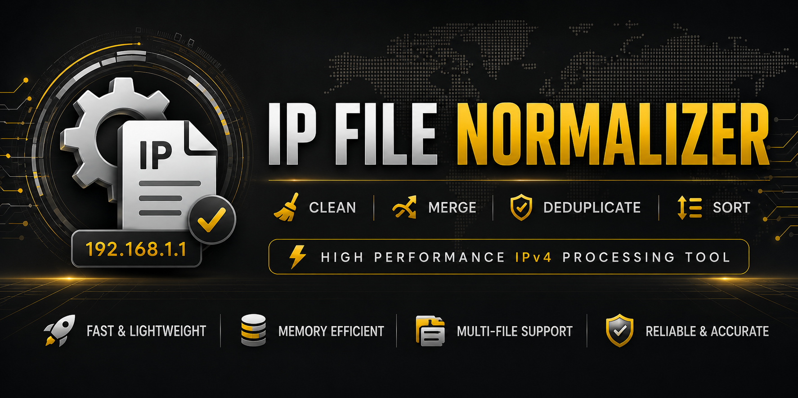

# 🚀 IP File Normalizer





[](https://dotnet.microsoft.com/)

[]()

[]()

[]()

[]()

[]()

[]()

[]()


[]()

[]()

[]()

[]()


---


### ⚡ Fast • Lightweight • Memory Efficient • Multi-File IP Processing • Cross-Platform • Self-Contained


A high-performance .NET 10 utility for cleaning, normalizing, merging, deduplicating and sorting massive IPv4 datasets.


**IP File Normalizer** is distributed as a **Self-Contained Application**, allowing end users to run it without installing the .NET SDK or .NET Runtime.


---


## 📑 Table of Contents


- [✨ Features](#-features)

- [📖 Overview](#-overview)

- [📁 Supported Input Formats](#-supported-input-formats)

- [💻 User Interface](#-user-interface)

- [📈 Statistics Engine](#-statistics-engine)

- [📂 Output Structure](#-output-structure)

- [⚡ Performance](#-performance)

- [🚀 Quick Start](#-quick-start)

- [📋 Usage](#-usage)

- [📸 Examples](#-examples)

- [🎯 Use Cases](#-use-cases)

- [🛠 Requirements](#-requirements)

- [🤝 Contributing](#-contributing)

- [📜 License](#-license)


---


## 📖 Overview


IP File Normalizer is a high-speed cross-platform command-line application designed to process large text files containing IPv4 addresses.


### 🎯 Core Capabilities


- 🔗 Merge multiple TXT files

- 🧹 Remove empty lines

- 🔁 Remove duplicates

- 🎯 Remove invalid IPs

- 📝 Strip unwanted text

- 🔌 Remove ports

- 📊 Sort IPv4 addresses

- 📁 Generate categorized result files

- ⚡ Process massive datasets efficiently

- 🌍 Run on Windows, Linux and macOS


---

## 📁 Supported Input Formats
IP File Normalizer is designed to work exclusively with plain text files.

| File Type | Supported |
|------------|------------|
| TXT | ✅ |
| CSV | ❌ |
| JSON | ❌ |
| XML | ❌ |
| XLSX | ❌ |
| XLS | ❌ |
| DOCX | ❌ |

---

### Supported Examples


```text

servers.txt

ips.txt

proxy-list.txt

targets.txt

```


### Unsupported Examples


```text

servers.csv

ips.json

targets.xlsx

data.xml

```


---

## ✨ Features


| Feature | Description |
|----------|------------|
| 🧹 NullFix | Remove empty lines |
| 🔁 DeDup | Remove duplicate lines and IPs |
| 🎯 InFix | Remove invalid IPv4 addresses |
| 📝 LetOut | Remove unwanted text around IPs |
| 🔌 DePort | Remove ports from IP:PORT entries |
| 📈 SortUp | Ascending IPv4 sort |
| 📉 SortDown | Descending IPv4 sort |
| 🔥 Del4 | Remove all IPv4 addresses |
| 🔗 Merger | Merge multiple TXT files |
| 🚀 ElonMod | Full automatic cleanup pipeline |

---

## 🚀 ElonMod Pipeline

```text
NullFix
   ↓
DeDup
   ↓
InFix
   ↓
LetOut
   ↓
DePort
   ↓
SortUp
```
One click. Fully cleaned dataset.

---


## 💻 User Interface
IP File Normalizer is a **CLI (Command-Line Interface)** application.

```text
Terminal / Console Based Application
```


### Supported Environments

- Windows Terminal
- Command Prompt (CMD)
- PowerShell
- Linux Terminal
- macOS Terminal

> **Note**
>
> This application does not provide a graphical user interface (GUI).
>
> All operations are performed through the command line / console.

---

## 📈 Statistics Engine

Before any operation starts, the application automatically analyzes the dataset.


### Collected Metrics

- Total Lines
- Empty Lines
- Duplicate Lines
- Lines With Text
- Lines With Ports
- Used Ports
- Total IPs
- Invalid IPs
- Duplicate IPs
- Valid IPv4 Count

### Example

```text
Total Lines       : 1,000,000
Empty Lines       : 1,204
Duplicate Lines   : 15,482
Invalid IPs       : 8,941
Valid IPv4s       : 974,373
```
---


\## 📂 Output Structure


```text

Results

│

├── 1. ElonMod

├── 2. Merger

├── 3. MultiMod

│

├── NullFix

├── DeDup

├── InFix

├── LetOut

├── DePort

├── SortUp

├── SortDown

└── Del4

```


Generated filenames:


```text

IP File Normalizer_06-15-2025\_12-45-11\_ElonMod.txt

```


\---


\## ⚡ Performance


Built for large-scale datasets.


\### Technologies


\- ConcurrentDictionary

\- Parallel Processing

\- Async File Operations

\- Memory-Based Processing


\### Optimized For


✅ Hundreds of thousands of lines


✅ Millions of IPv4 addresses


✅ Multi-file processing


✅ High-speed cleanup operations


✅ Large TXT datasets


\---


\## 🚀 Quick Start


\### Clone


```bash

git clone https://github.com/Abel404Dev/IP-File-Normalizer.git

```


\### Enter Directory


```bash

cd IP-File-Normalizer

```


\### Build From Source


```bash

dotnet build

```


\### Run From Source


```bash

dotnet run

```


\### Run Release Build


\#### Windows


```powershell

.\IP.File.Normalizer_windows_x64.exe

```


\#### Linux


```bash

chmod +x IP.File.Normalizer_linux_x64

./IP.File.Normalizer_linux_x64

```


\#### macOS


```bash

chmod +x IP.File.Normalizer_macos_x64

./IP.File.Normalizer_macos_x64

```


\---


\## 📋 Usage


\### Single TXT File


```text

C:\\IPs\\file1.txt

```


\### Multiple TXT Files


```text

'C:\\IPs\\file1.txt',"C:\\IPs\\file2.txt" C:\\IPs\\file3.txt

```


\### Available Operations


```text

1 = NullFix

2 = DeDup

3 = InFix

4 = LetOut

5 = DePort

6 = SortUp

7 = SortDown

8 = Del4

9 = Merger

0 = ElonMod

```


\---


\## 📸 Examples


\### Input


```text

ServerA:192.168.1.1:80


192.168.1.1

999.999.999.999


Google DNS 8.8.8.8:53

```


\### Output (ElonMod)


```text

8.8.8.8

192.168.1.1

```


\---


\## 🎯 Use Cases


\- 🌐 Proxy List Cleanup

\- 🔎 OSINT Datasets

\- 🛡 Firewall Imports

\- 📡 Network Inventory Management

\- 🔬 Security Research

\- 🚨 Vulnerability Scanning Preparation

\- 📊 Large IPv4 Data Processing

\- 📦 Bulk TXT File Normalization

\- ⚙️ Data Preparation Pipelines


\---


\## 🛠 Requirements


\### For End Users


\*\*None.\*\*


Official releases are distributed as \*\*Self-Contained Executables\*\*.


You do \*\*NOT\*\* need to install:


\- .NET SDK

\- .NET Runtime

\- Additional Dependencies


\### Supported Platforms


| Platform | Supported |

|-----------|------------|

| 🪟 Windows | ✅ |

| 🐧 Linux | ✅ |

| 🍎 macOS | ✅ |


\### For Developers


To build the project from source:


\- .NET 10 SDK


Download:


https://dotnet.microsoft.com/download


\---


\## 🤝 Contributing


Contributions are welcome.


If you have ideas, bug reports or improvements:


\- Open an Issue

\- Submit a Pull Request

\- Suggest New Features


\---


\## 📜 License


MIT License


\---


⭐ If this project helped you, consider giving it a Star.
Made with ❤️ and ☕ for the networking & security community.
